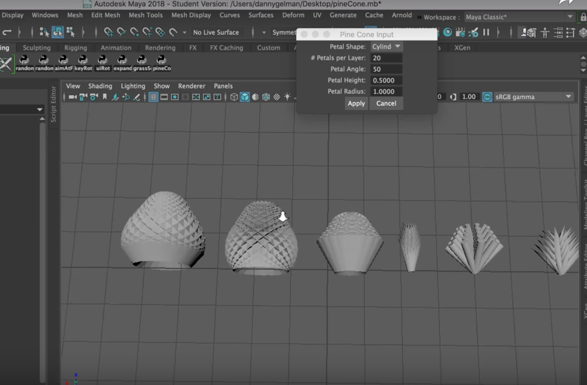

# Pine Cone Generator 🌰🌲 

This is a tool for Maya that creates pine cones. Users specifiy the pine cone to be cylinder/cone based, the numebr of "petals" in each layer, how tightly they are angled, their height, and their radius.

To see the tool in action: https://www.youtube.com/watch?v=BTypuhGzkXQ

